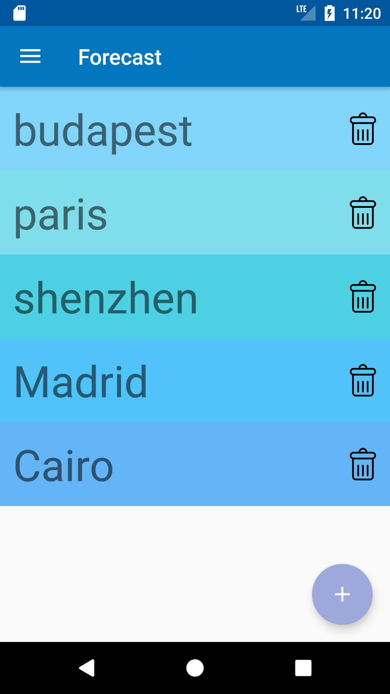
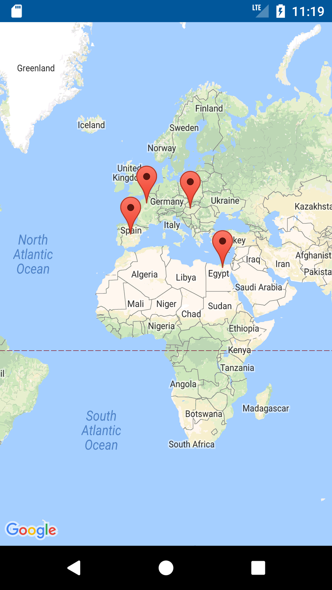
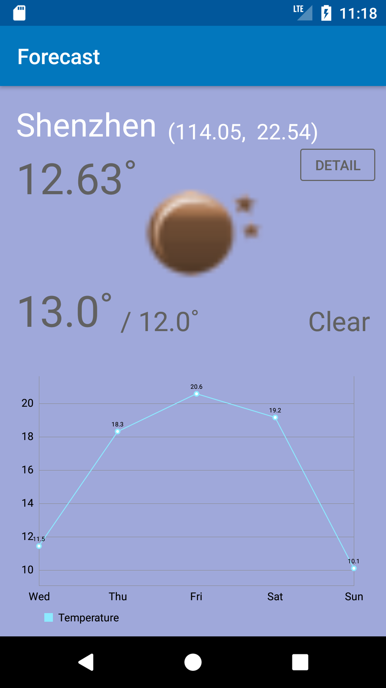
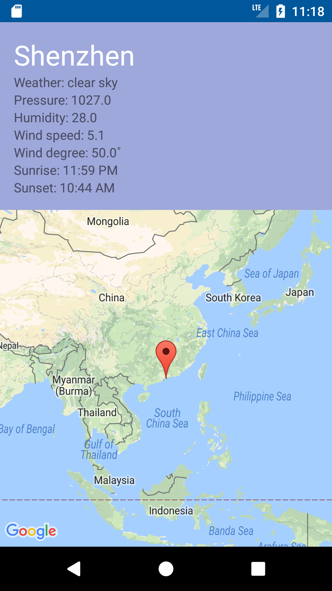

# Andorid_Forecast
A weather info application that shows the weather info from *OpenWeatherMap* (current temperature, description, weather icon, min and max temperature, sunrise and sunset, etc.) and a small map that shows the current city. The users can add, delete and edit the cities that they want to check weather. The users can access information of the day's weather of the city and also the next 5 day's forecast. An overview map can be displayed with markers to all cities and by clicking on the city name, the weather details are shown. 

## Getting Started
These instructions will get you a copy of the project up and running on your local machine for development and testing purposes.
### Prerequisites
Android Studio
### Installing
```
# Clone this repository
$ git clone https://github.com/meganzhao/Andorid_Forecast.git

# Go into the repository
$ cd Andorid_Forecast
```
### Running the app
Start Android studio and Import Project 

## Features And Technologies Implemented 
* Use MPAndroidChart library to display a chart of the forecast
* Use Glide library to show the weather icon from the retrieved JSON result
* Fragments with special views such as CardView, RecyclerView and NavigationDrawer
* Communication with the *OpenWeatherMap* web API
* Persistant data using Realm
* Map view with markers


## App Demo
                   


                   

